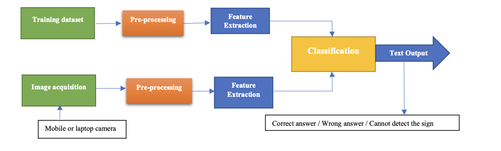
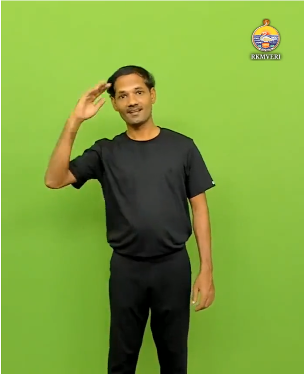
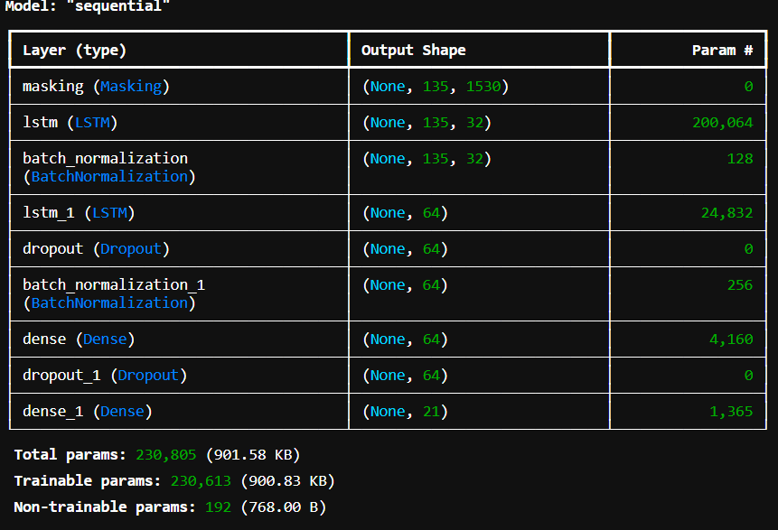

# Indian Sign Language Recognition

## Overview
This project focuses on recognizing Indian Sign Language (ISL) gestures using video input. It leverages computer vision to extract hand landmarks from video frames and utilizes a Long Short-Term Memory (LSTM) model to classify gestures. The system is designed to aid communication for individuals with hearing and speech impairments.

## Features
- **Real-time Video Processing:** Captures video input to recognize ISL gestures.
- **Landmark Extraction:** Uses MediaPipe or OpenPose to extract hand landmarks.
- **Gesture Recognition:** LSTM-based model for sequence classification.
- **Scalability:** Supports training with an extended set of ISL gestures.
- **User-Friendly Interface:** Can be integrated into applications for accessibility solutions.

## Workflow
1. **Video Capture:** The system records a video of hand movements.
2. **Landmark Detection:** Extracts hand landmarks (X, Y, Z coordinates) from each frame.
3. **Feature Processing:** Normalizes and processes the extracted coordinates.
4. **Sequence Classification:** Uses an LSTM model to classify gestures.
5. **Prediction Output:** Displays or converts recognized gestures into text or speech.



## Technologies Used
- **Python** (OpenCV, NumPy, Pandas)
- **MediaPipe** (for hand landmark detection)
- **TensorFlow/Keras** (for LSTM model training and prediction)
- **Matplotlib & Seaborn** (for data visualization)

## Installation
1. Clone the repository:
   ```bash
   git clone https://github.com/UnbeatableBann/Indian Sign Language.git
   cd Indian Sign Language
   ```
2. Install dependencies:
   ```bash
   pip install -r requirements.txt
   ```
3. Run the application:
   ```bash
   python main.py
   ```

## Dataset
- The model is trained on a dataset of ISL gestures.
- Each gesture video is converted into a sequence of landmark coordinates.
- The dataset includes common ISL gestures like greetings, alphabets, and numbers.



## Model Training
1. **Preprocess Data:** Extract landmarks from videos and store them in CSV or NumPy arrays.
2. **Train LSTM Model:**
   ```python
   python train.py
   ```
3. **Evaluate Model:** Assess accuracy using test datasets.



## Future Enhancements
- Expand gesture vocabulary for better recognition.
- Implement a real-time translation system.
- Improve accuracy with attention-based neural networks.
- Develop a mobile application for on-the-go recognition.

## Contributors
- Your Name (@yourgithub)

## License
This project is licensed under the MIT License.

## Acknowledgments
- Inspired by research on sign language recognition.
- Thanks to the open-source community for resources and tools.

